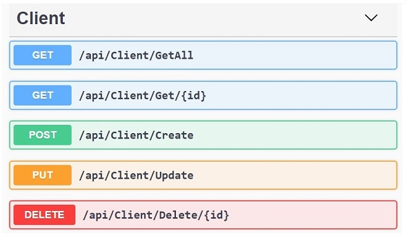

# RESTfulClient

RESTful web service with .NET Core and C#; It contains the main HTTP methods.

## General Description
This is a Restful Service containing web applications Services that return their response in JSON. Here is a sample depicting one of these responses:
> [{"clientId":1,"name":"John Smith","address":"1st Street", "phoneNumber":null,"email":"john@provider.com","photoFileId":null,
"modifiedBy":"Lucas Moraes","modifiedOn":"2020-06 30T23:25:46.637"},  
 {"clientId":2,"name":"Will Doe","address":"2st Street", "phoneNumber":null,"email":"will@provider.com","photoFileId":null,
"modifiedBy":"Lucas Moraes","modifiedOn":"2020-07-01T23:25:46.546"}]

## How to run this service
You will need the following:
-	.NET Core 3.1 or higher;
-	SQL Server 2019;
-	Run the CREATE script on the document *Restful-ApplicationGuide.pdf*

After you clone this repo, go ahead and execute *RunRestfulClient.bat* to open the index page of this service.
